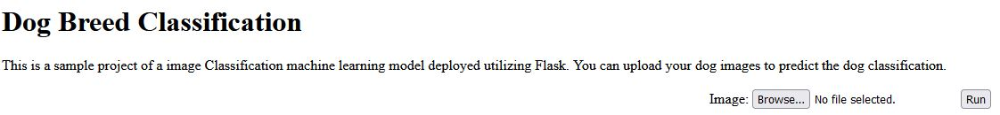
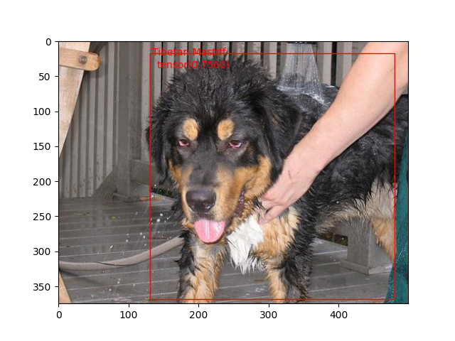

<h3 text-align="center">Dog Image Object Classification</h3>

<p>
This project was completed as the capstone of the USCD Machine Learning Bootcamp. The goal of this project is to demonstrate the usage of a trained image classification algorithm using Flask and Python. Users can upload their images and have the algorithm detect the dog breed.

</p>

### Built With
* [Python](python.org)
* [Flask](flask.palletsprojects.com/en/2.2.x/)


<!-- GETTING STARTED -->
## Getting Started

To get a local copy up and running follow these simple steps.

### Prerequisites

This is an example of how to list things you need to use the software and how to install them.

* detecto==1.2.2
* Flask==2.0.1
* Flask_Cors==3.0.10
* matplotlib==3.6.2
* scikit_image==0.19.3
* skimage==0.0
* torch==1.13.0

### Installation

To use this directory in your own local machine. Clone this directory.

Then in the root folder simply run the python file 
```
python app.py
```
and you should see the production server starting on your local machine

Upload your dog image to the prediction



And have the server return and tell you your dog breed.

### Future Works

The application is trained on [stanford dogs breed dataset](http://vision.stanford.edu/aditya86/ImageNetDogs/)

Manually annotating the dog breed dataset for my algorithm and inserting transformations takes time, so not all of the dog breeds are available at the moment, i may revisit this in the future and include more classes into the prediction service


The application actually returns the full image including the bounding boxes to the user as an output, however I have been unable to have this show and run successfully using flask